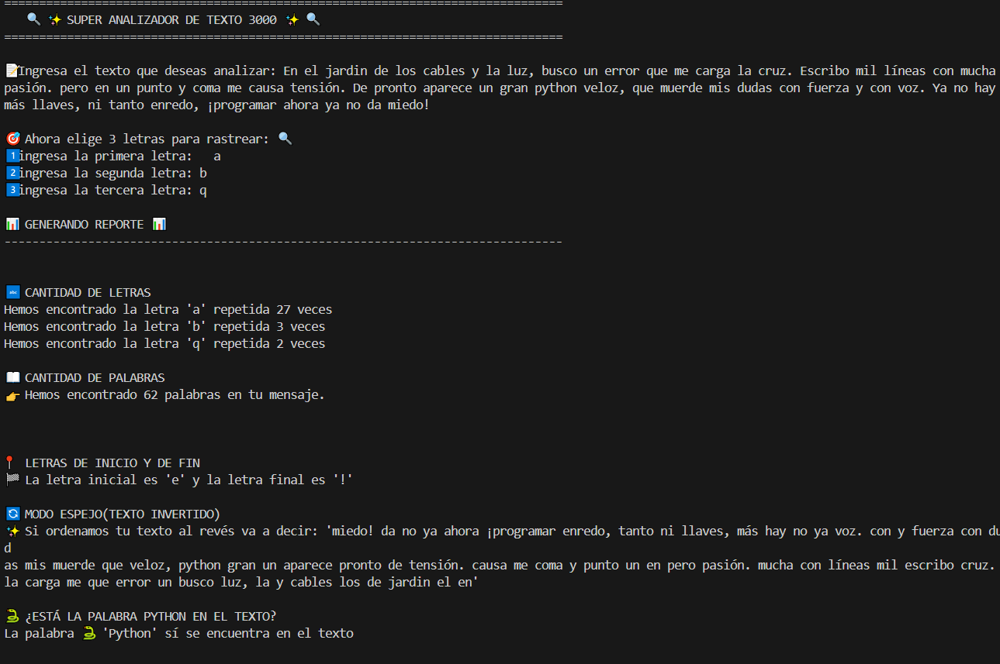
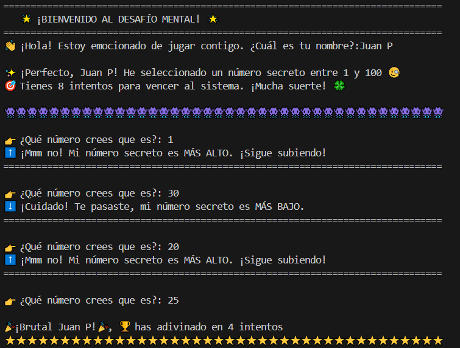
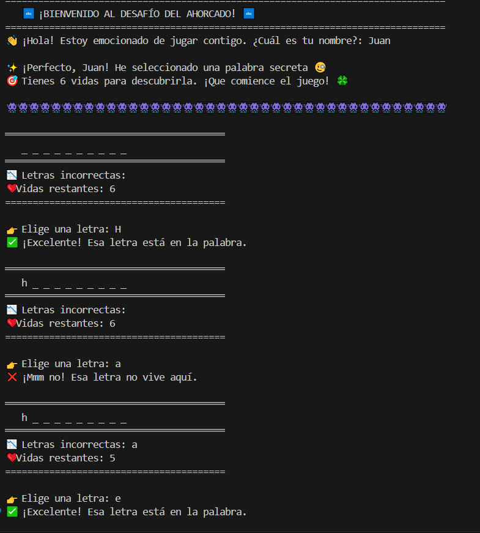
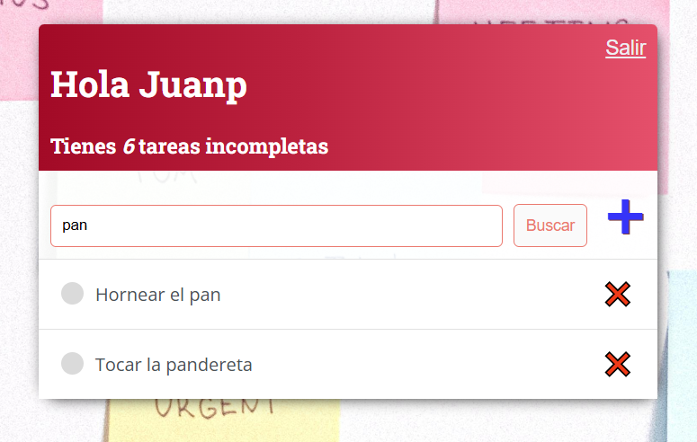

# 🐍 Mis Proyectos de Python | Bitácora de Aprendizaje

¡Hola! 👋 Bienvenido a este espacio donde comparto mi evolución como programador. 

Este repositorio es una recopilación personal de proyectos desarrollados para **reforzar conocimientos, explorar nuevas librerías y documentar mi proceso diario.** Aquí no solo hay código, hay horas de práctica y ganas de aprender algo nuevo cada día. 🚀

---

## 🛠️ Lo que encontrarás aquí:
- 📂 **Mini-proyectos:** 
- 🌐 **Desarrollo Web:** 
- ⚙️ **Configuraciones:** 
- 📚 **Notas de estudio:** 

---

## 📅 Registro de Avance Diario

### 🔹 DÍAS 01 y 02: Fundamentos de Interacción y Lógica Comercial
**Descripción:** En estas primeras jornadas me enfoqué en la base de la programación en Python: la entrada y salida de datos, y la manipulación de tipos numéricos. Desarrollé dos herramientas que simulan aplicaciones del mundo real:

1. **Branding Express (Cervecería):** Un ejercicio de concatenación de strings y saltos de línea (`\n`) para generar nombres de marca creativos mediante inputs dinámicos.
2. **Calculadora de Comisiones v2.0:** Implementación de lógica matemática para el sector ventas. El programa calcula un 13% de comisión sobre el total vendido, utilizando `round()` para precisión financiera y f-strings para reportes limpios.

---

### 🔹 DÍA 03: Analizador de Textos Inteligente
**Descripción:** Este proyecto marca el dominio de las estructuras de datos y métodos de strings. El objetivo fue crear un software que "entienda" y descomponga un texto proporcionado por el usuario.

**Tecnologías aplicadas:**
* **Métodos de String:** Uso de `.lower()`, `.count()` y `.split()`.
* **Manejo de Listas:** Reversión de elementos con `.reverse()` y unión con `.join()`.
* **Indexación:** Extracción de caracteres específicos mediante posiciones de índice.
* **Búsqueda de Patrones:** Lógica booleana para detectar palabras clave (Python).

#### 📸 Galería del Proyecto (Día 03)

| Análisis de Texto en Proceso |
| :---: |
|  |
| *Procesamiento de métricas y modo espejo activado* |

### 🔹 DÍA 04: Lógica de Juego y Control de Flujo
**Descripción:** Desarrollo de un videojuego de consola basado en el concepto de "Adivina el Número". Aquí integré la toma de decisiones compleja y el manejo de ciclos infinitos controlados.

**Desafíos Técnicos superados:**
1. **Librería Random:** Implementación de `randint` para aleatoriedad.
2. **Ciclos While:** Gestión de un sistema de 8 intentos (vidas) del jugador.
3. **Validación Lógica:** Creación de respuestas dinámicas ("Más alto" / "Más bajo") mediante operadores de comparación.

#### 📸 Galería del Proyecto (Día 04)

| Interfaz del Desafío Mental |
| :---: |
|  |
| *Feedback en tiempo real y gestión de intentos* |

### 🔹 DÍA 05: El Juego del Ahorcado (Modularización y Funciones)
**Descripción:** Este proyecto fue un paso clave en mi forma de pensar como programador. Pasé de escribir código lineal a estructurarlo mediante **funciones**, lo que me permitió crear un sistema mucho más limpio y fácil de mantener. Diseñé una versión interactiva del "Ahorcado" donde la lógica se divide en tareas pequeñas que trabajan juntas.

**Lo que aprendí y apliqué:**
* **Modularidad:** Creación de funciones específicas para elegir palabras, validar letras y actualizar el tablero.
* **Paso de Parámetros:** Entendí cómo enviar información entre funciones y el uso estratégico de los `return`.

#### 📸 Galería del Proyecto (Día 05)

| Interfaz del Juego del Ahorcado |
| :---: |
|  |
| *Tablero dinámico y gestión de vidas con feedback visual* |

### 🔹 DÍA 14: Biometría Facial & Control de Asistencia Profesional
**Descripción:** En esta jornada exploré el potencial de la Inteligencia Artificial aplicada a la seguridad y control de personal. Desarrollé dos sistemas complementarios utilizando librerías de vanguardia como `face_recognition` y `OpenCV`:

1.  **Módulo de Identificación de Precisión:** Un programa diseñado para comparar rostros con un alto nivel de exactitud. El sistema procesa imágenes, las convierte al espacio de color RGB y extrae "encodings" (firmas matemáticas únicas de cada cara). Mediante el cálculo de la distancia y niveles de tolerancia ajustables, el script determina si dos fotos pertenecen a la misma persona con un margen de error mínimo.
2.  **Sistema de Control de Asistencia Real-Time:** Construí una herramienta que utiliza la webcam para identificar empleados en una base de datos local. Al detectar una coincidencia positiva, el sistema no solo etiqueta el rostro en el video en tiempo real, sino que genera automáticamente un registro en un archivo `.csv` con el nombre y la hora exacta de conexión (`datetime`), ideal para entornos laborales reales.

#### 📸 Galería del Proyecto (Día 14)

| Comparativa de Precisión | Reconocimiento en Cámara |
| :---: | :---: |
|  |  |
| *Análisis de similitud y distancia facial* | *Identificación en vivo sobre la webcam* |

| Registro Automatizado (CSV) |
| :---: |
|  |
| *Log de ingresos con marca de tiempo* |

---

### 🔹 DÍA 15: Gestor de Tareas Profesional (Django)
**Descripción:** ¡Salto al desarrollo web! En este proyecto exploré la creación de entornos virtuales desde cero y la estructura de un proyecto Django. Trabajamos en el control de URLs, la creación de "esqueletos" HTML reutilizables y el uso de etiquetas de texto dinámicas. 

Lo más destacado fue la implementación de **lógica de negocio real**: vistas de cuentas de usuario, sistemas de logueo seguros, restricciones de acceso (para que cada usuario solo vea sus tareas) y el estudio profundo de elementos de interfaz.

#### 📸 Galería del Proyecto (Día 15)

| Vista Principal de App | Pantalla de Logueo |
| :---: | :---: |
|  |  |

| Buscador de Tareas | Agregar Nueva Tarea |
| :---: | :---: |
|  |  |
---

## 🎓 Créditos y Formación
Muchos de los proyectos y ejercicios documentados aquí forman parte de mi proceso de aprendizaje en el curso:
- **[Python Total - 16 días de programación](https://www.udemy.com/course/python-total/)** impartido por **Federico Garay** de **Escuela Directa**. 
- Este repositorio sirve como evidencia de mi progreso a través de sus 16 proyectos reales y 160 ejercicios.

---
*“La constancia es la clave del éxito en el código.”* 💻✨

## 📫 Contacto  
Puedes contactarme en **[juanpaapon@gmail.com](mailto:juanpaapon@gmail.com)** o a través de [LinkedIn](https://www.linkedin.com/in/juan-pablo-aponte-murcia-36603627a/).
Celular: +573202163272
<table align='center'>
  <tr>
    <td align='center'>
      

        
        <a href="https://github.com/JPjuanaponte" target="_blank" rel="author">
          <h4 style="margin-top: 1rem;">Juan Aponte  
              </a>
        
        

      

    </td>